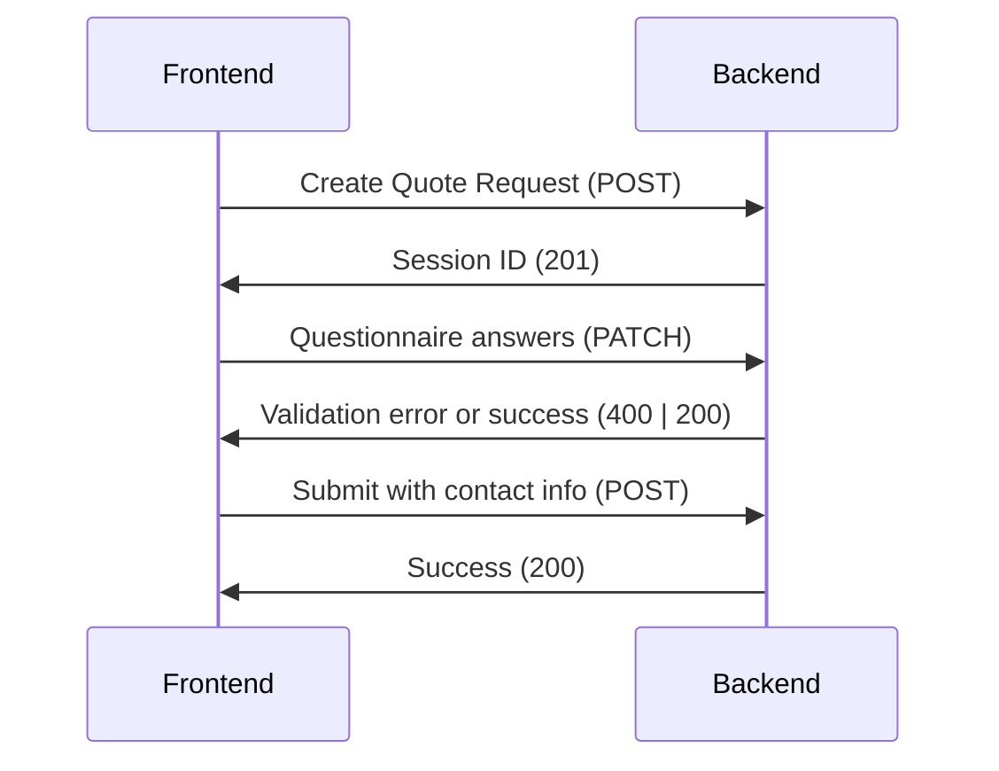
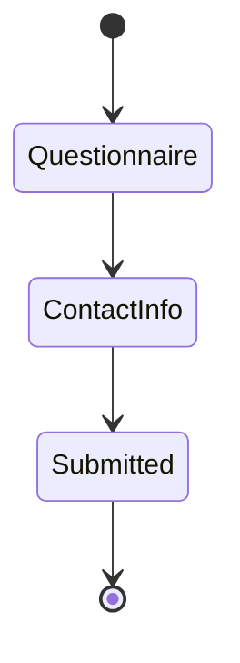

# Exercise 02 - Multi-Step Wizard Application

Below are details about the second exercise

## Getting Started

### Backend

Use npm scripts to build, lint, test, and run the dev server

```bash
cd backend

# (optional) use a consistent version of node
nvm use

# install dependencies
npm install

# build, lint, test
npm run build
npm run lint
npm test

# start the dev server (localhost:3001)
npm run start:dev
```

### Frontend

Use npm scripts to build, lint, test, and run the dev server

```bash
cd frontend

# (optional) use a consistent version of node
nvm use

# install dependencies
npm install

# build, lint, test
npm run build
npm run lint
npm test

# start the dev server (localhost:3000)
npm run dev
```

## Design

### Sequence diagram



1. The frontend starts the process by issuing a POST request on the Quote Request resource.  The server responds with a Session ID to use in subsequent requests.

```
# example:
POST /api/quote_request
=> { "sessionId": "550e8400-e29b-41d4-a716-446655440000" }
```

2. The frontend issues multiple PATCH requests on the Quote Request session with a set of ke/values to be validated and saved in the database.  The backend either returns validation errors or saves the record and returns the latest copy.  It may progress the state if necessary in the returned object.

```
# example:
PATCH /api/quote_request/550e8400-e29b-41d4-a716-446655440000
```

3. To complete the process, the frontend sends a POST to the Quote Request session.

```
# example
POST /api/quote_request/550e8400-e29b-41d4-a716-446655440000
```

### State diagram



* The backend maintains the state of the object
* When a new Quote Request is created, it starts in Questionnaire state
* When all questions are answered, the state is progressed to ContactInfo
* Depending on some of the answers, backend may decide to progress to ContactInfo early

## Docker Support

Launch with docker to simulate a realistic environment or to minimize development environment dependencies

1. Start the services with `docker compose`:
```bash
docker compose up --build
```

1. Access the services at the following URLs

* Frontend: http://localhost:3000
* Backend API: http://localhost:3001
* MongoDB: mongodb://localhost:27017/wizard_app

## Next steps

Other things I'd like to do given more time

- [ ] Persist state in local storage so that sessions can be resumed when refreshing browser or returning later
- [ ] Use mono repo pattern to better manage multiple projects within a single repo (ex: Lerna)
- [ ] Publish npm packages and docker image to Github Packages
- [ ] Define AWS infrastructure with Infrastructure as Code (ex: CDK or Terraform)
- [ ] Continuous Delivery: auto deploy changes to AWS

## Original Scope

## Overview

In this challenge, you will create a simple and lightweight full-stack application that simulates a multi-step quote request wizard for HVAC installations. This is a simplified version of a real-world scenario where our customers request a quote online for our services. You can see our current implementation in our website www.minthome.com (At the moment we are only servicing Texas, Nevada and Arizona).

## Requirements

### Technology Stack

- **Frontend**: Next.js
- **Backend**: NestJS
- **Database**: Your choice. At Mint we use MongoDB, so if you prefer you can explore something like MongoDB Memory Server, or SQLite, the idea is that your submission should be complete and run without the need to setup a DB Server.

### Wizard Flow

Create a multi-step wizard with the following flow:

1. **Step 1: Address Collection**
   - Ask the customer for their address (street, city, state, zip code)
   - Include validation for required fields and proper formatting
   - No need to include Google APIs, just collecting information in a simple form is enough. Your choice how complex this form can be.

2. **Step 2: AC Unit Quantity**
   - Ask how many AC units they have:
     - 1
     - 2
     - More than 3
     - I don't know
   - If they select **more than 3** or **I don't know**, navigate to a contact page where they enter their name and phone number, with a message that we will contact them once they submit their information.

3. **Step 3: System Type** (only if they chose 1 or 2 AC units)
   - Let them select the system type:
     - Split
     - Package
     - I don't know
   - If they select **I don't know**, navigate to the contact page mentioned above

4. **Step 4: Heating Type** (only if they chose a specific system type)
   - Select the heating type:
     - Heat pump
     - Gas
     - I don't know
   - If they select **I don't know**, navigate to the contact page mentioned above

5. **Step 5: Contact Information**
   - Collect:
     - Name
     - Phone number
     - Email address
   - Bonus: Include proper validation for all fields

6. **Step 6: Confirmation**
   - Display a confirmation page showing all the information they've provided
   - Include a thank you message


### Backend Requirements

1. Create a NestJS backend API with the following features:
   - Store user data as they progress on the wizard.
   - Create RESTful APIs for:
     - Determining the next step and storing the progress in the wizard based on user selections (`/api/wizard/next-step`)
     - Storing user information and quote request details (`/api/quote-request`)
     - Any other endpoint that you think it is necessary for a complete solution.
   - Bonus: Write basic tests for your API endpoints

### Frontend Requirements

1. Create a Next.js frontend that:
   - Implements the multi-step wizard UI
   - Communicates with the backend API
   - Provides a responsive design that works on both desktop and mobile
   - Bonus: Includes form validation and / or make the UI beautiful :D
2. Other requirements
   - User should be able to navigate back to update their selection
   - Show a step indicator so the user knows which step they are in
   - The logic about what step to go next comes from the backend

## Evaluation Criteria

Your solution will be evaluated based on:

1. **Functionality**: Does it meet all the requirements?
2. **Code Quality**: Is the code well-structured, readable, and maintainable?
3. **User Experience**: Is the wizard intuitive and easy to use?
4. **Error Handling**: How well does it handle errors and edge cases?
5. **Testing**: Are there sufficient tests to ensure functionality?
6. **Documentation**: Is the code well-documented? Is there clear documentation on how to run the application?

## Submission

Create a separate repository for this challenge and provide:

1. Complete source code for both frontend and backend
2. A README.md with:
   - Setup instructions for both frontend and backend
   - Any assumptions or design decisions you made
   - Any additional features you implemented

You can either share the repository URL or provide a ZIP file with your solution.

## Tips

- Use TypeScript for type safety
- Consider using form libraries like ShadCN (https://ui.shadcn.com/)
- Document your code and provide clear instructions for running your application
- You are free to use AI tools / AI Agents to assist on your solution
